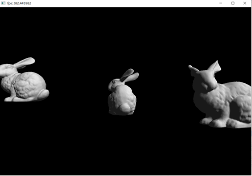
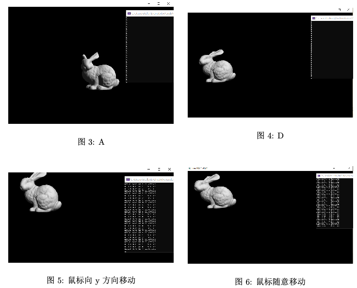

# Computer Graphics Lab

Lab for Computer Graphics Course

## Lab1. Draw a Flag

## Lab2. Transformation

## Lab3. Camera

## Lab4. Instance

## Lab5. Light & Shade

## Lab6. Texture 

Lab6 is a independent Visual Studio project because my version for Lab1 - 5 is quite different with TA's. 

## Project

A demo video: [https://github.com/SurvivorK/CG/blob/main/project%20demo.mp4]

